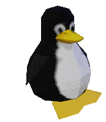

<div align="center">



```text
██████╗ ██╗███████╗ ██████╗  ██████╗
██╔══██╗██║██╔════╝██╔════╝ ██╔═══██╗
██║  ██║██║█████╗  ██║  ███╗██║   ██║
██║  ██║██╔██║     ██║      ██║   ██║
██████╔╝██║███████╗╚██████╔╝╚██████╔╝
╚═════╝ ╚═╝╚══════╝ ╚═════╝  ╚═════╝
````

### Linux SysAdmin • Network Administrator • Cybersecurity Enthusiast

</div>

---

## 👨‍💻 About Me

🎓 Computer Science Student

🐧 Passionate Linux user and advocate of Free and Open Source Software (FOSS)

🔒 Interested in Cybersecurity, Infrastructure and System Administration

🌐 Building and maintaining networking and server environments

⚙️ Focused on automation, monitoring and self-hosted solutions

🏠 Currently developing Home Lab and Infrastructure projects

---

> "The quieter you become, the more you are able to hear." — Linux Philosophy

